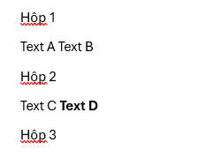

Câu A1:
1. Khi bạn gõ https://shopee.vn vào trình duyệt và nhấn Enter, hãy liệt kê đúng thứ tự ít nhất 5 bước xảy ra (từ DNS lookup đến render)

    1. dịch tên miền shopee.vn thành địa chỉ IP máy chủ
    2. thiết lập kết nối mạng và tạo kênh truyền dữ liệu an toàn
    3. trình duyệt gửi lệnh yêu cầu tải nội dung trang chủ đến máy chủ shopee
    4. máy chủ shopee xử lý và trả về các file dữ liệu (HTML, CSS, JS, file ảnh...)
    5. trình duyệt đọc dữ liệu, sắp xếp bốc cục và render ra giao diện web hoàn chỉnh lên màn hình

2. .png>)
    .png>)
    .png>)

Câu A2:
    - tại vì lạm dụng thẻ 
. thẻ <dix> là thẻ non-semantic và nó chỉ dùng để gom nhóm các phần tử cho mục đích CSS chứ không giải thích ý nghĩa của nội dung bên trong
    - các lỗi sematic:
        + 
        -> <header>
        + 
          -> <nav>
        + 
          -> <main>
        + 
         -> thay bằng các thẻ heading <h1> - <h6>
        +  thiếu thuộc tính alt    -> bổ sung thêm thuộc tính alt
        + 
        -> <footer>
        + 
       -> <section>

Câu A3:

Câu A4:
    - sự khác nhau giữ <thead>, <tbody>, <tfoot>
    + <thead>: dùng để gom nhóm các hàng chứa tiêu đề của cột
    + <tbody>: dùng để chứa nội dung dữ liệu chính của bảng.
    + <tfoot>: dùng để gom nhóm các hàng chứa thông tin tổng kết ở cuối bảng

    - lý do không nên dùng <table> để tạo layout web:
    + <table> sinh ra chỉ để hiển thị dữ liệu dạng bảng, dùng nó để làm layout sẽ bị làm giảm điểm SEO

    + tốc độ render chậm:
        browser phải tính toán kích thước của toàn bộ bảng từng hàng một rồi mới bắt đầu render lên màn hình

    + mã nguồn cồng kềnh:
        layout bằng table sẽ phải lồng các bảng vào nhau, bảng này nằm trong ô <td> của bảng kia, vô số thuộc tính colspan, rowspan tạo ra một mớ hỗn độn dẫn đến việc bảo trì code thành tra tấn

Bài B3: Debug HTML
    Lỗi 1: dòng 1 - lỗi khai báo <!DOCTYPE> thiếu html - cách sửa: <!DOCTYPE html>

    LỖI 2: dòng 4 - lỗi quên đóng thẻ <title> - cách sửa: <title>Trang web</title>

    LỗI 3: dòng 5 - Lỗi chuẩn hóa <meta charset> - cách sửa: <meta charset = "UTF-8">

    Lỗi 4: dòng 8 - sai cứ pháp đóng thẻ - cách sửa: <h1>Welcome to ShopTLU</h1>

    Lỗi 5: dòng 12 - sai cú pháp đóng thẻ <a> - cách sửa: <a href="home">Trang chủ</a>

    Lỗi 6: dòng 19 - Lỗi thiếu thuộc tính, dấu ngoặc kép ở thẻ  - cách sửa: 

    Lỗi 7: dòng 21 - Lỗi chồng chéo thẻ, thẻ nào mở sau thì phải đóng trước - cách sửa: 
Giá: <b>25.990.000đ</b>

    Lỗi 8: dòng 26-29 - hàng đầu tiên của bảng là tiêu đề cột, lại dùng thẻ <td> - cách sửa: <th>Tên</th> <th>Giá</th>

    Lỗi 9: dòng 37-39 - lạm dụng thẻ main - cách sửa: thai <main> thứ hai thành <aside>...</aside>

    Lỗi 10: dòng 42 - lỗi quên đóng thẻ 
 - cách sửa: 
Copyright 2026

    Lỗi 11: dòng cuối file - quên đóng thẻ <html> - cách sửa: thêm </html> vào dưới cùng sau thẻ </body>

    Bài B4:
    1.  3 thẻ semantic HTML5 mà trang web đang sử dụng:

    +)  <header>: Được sử dụng để chứa phần đầu của trang web (top bar, logo, thanh tìm kiếm). Vị trí: <header class="header v2024 theme-reunification hasbanner sticky1" data-sub="0">

    +)  <h1>: Được sử dụng cho tiêu đề chính của trang
    Vị trí: Ngay trên 

    +)  <section> Vị trí: <section class="search-trend">

    - 2 thẻ không dùng đúng senmatic:

    +)  
. nếu về senematic nên thay bằng thẻ <main>
    
    +)  
 và 
:
    về mặt ngữ nghĩa thì nên dùng thẻ <aside>

    2.  về thẻ <table>:
    
    +)  Table đang sử dụng để hiển thị thông số kỹ thuật của sản phẩm đang xem

    +)  có dùng <tbody> bên trong chứa các <tr>

    +)  bảng này không dùng <thead>, các nội dung được định dạng trực tiếp vào các hàng <tbody>

    3.  Thẻ form:

    +)  Form có sử dụng thuộc tính action="/tim-kiem

    +)  Trong thẻ <form> này không khai báo thuộc tính method

    +)  sử dụng 2 loại type:
        Thẻ <input> sử dụng type="text"
        Thẻ <button> sử dụng type="submit"

    Câu C1:
    <header>
        <nav>                                          <!-- liên kết điều hướng -->
            <ul> <li><a href="#">...</a></li> </ul>
        </nav>
    </header>

    <main> 
        <nav aria-label="breadcrumb">                   <!-- liên kết điều hướng -->
            <ol>                                        <!-- ol vì breadcrumb có thứ tự -->
                <li><a href="/">Trang chủ<a></li> 
                <li><a href="/dien-thoai">Điện thoại</a></li>
                <li><a href="/iphone-16" aria-current="page">iPhone 16</a></li> 
            </ol>
        </nav>

    <article>           <!-- Dùng để đóng gối toàn bộ khối thông tin của sản phẩm đang xem -->
        <section>       <!-- chia nhỏ nội dung theo từng chủ đề-->
            <figure>    <!-- nhóm các hình ảnh lại thành 1 gallery -->
                 
                
                
                
                
            </figure>
        </section>

        <section> 
            <h1>...</h1>        <!-- tiêu đề của trang, vd là trang chi tiết sản phầm thì <h1> là Tên sản phẩm>
            
...
          <!-- tên, giá, sản phẩm -->
            
...
      <!-- dùng để đánh giá sao -->
            
...
          <!-- mô tả sản phẩm -->
        </section>
    </article>

    <section> 
        <h2>...</h2>            <!-- Tiêu đề phụ cho các vùng nội dung như là thông số kỹ thuật hay đánh giá từ khách hàng -->
        <table>                 <!-- dùng cho bảng thông số kỹ thuật>
            <tbody> 
                <tr> 
                    <th>...</th> 
                    <td>...</td> 
                </tr>
            </tbody>
        </table>
    </section>

    <section> 
        <h2>...</h2> 
            <ul> 
                <li> 
                    <article>...</article> 
                </li>
            </ul>
    </section>

<   /main>

    <aside>                     <!-- dành cho các nội dung liên quan gián tiếp đến nội dung chính vdu: khu vực sản phẩm tương tự ở thanh bên>
        <h2>...</h2> 
            <ul> 
                <li> 
                    <article>...</article> 
                </li>
            </ul>
    </aside>

    <footer> 
...
 </footer>

    Câu C2:
    Về mặt SEO (Tối ưu hóa công cụ tìm kiếm), Các bot của Google không "nhìn" giao diện bằng mắt mà quét qua cấu trúc mã nguồn. Các thẻ semantic như <article>, <main> hay <h1> đóng vai trò như các biển báo, giúp bot hiểu ngay đâu là nội dung cốt lõi của trang. Một website chỉ toàn 
 sẽ tạo ra một cấu trúc phẳng lì, vô nghĩa, khiến bot khó đánh giá đúng nội dung, dẫn đến việc rớt hạng thê thảm trên kết quả tìm kiếm.

    Về mặt Accessibility (Khả năng tiếp cận), những người khiếm thị sử dụng trình đọc màn hình (Screen Reader) phụ thuộc hoàn toàn vào thẻ HTML để điều hướng. Trình đọc sẽ thông báo một thẻ <nav> là khu vực điều hướng để họ có thể bỏ qua, nhưng nó sẽ không thể phân biệt được một 
 với các đoạn văn bản bình thường khác.

    Thực tế chứng minh Semantic HTML giúp ích là khi tạo nút bấm, thẻ <button> mặc định đã hỗ trợ người dùng tương tác bằng phím Tab và Enter/Space. Nếu bạn dùng 
, bạn sẽ phải viết thêm nhiều dòng JavaScript và thuộc tính ARIA chỉ để "phát minh lại" tính năng cơ bản đó. Thực chất, dùng 
 sai chỗ lại càng tốn thời gian hơn.

    Trường hợp thực tế thẻ 
 vẫn cực kỳ cần thiết khi nó đóng vai trò làm "vỏ bọc" (wrapper/container) thuần túy phục vụ cho việc dàn layout CSS (như Flexbox hay Grid). Ví dụ: Gom nhóm một ảnh sản phẩm và giá tiền vào chung một 
 để dễ dàng bo góc hoặc đổ màu nền. Bản thân sự gom nhóm này chỉ nhằm mục đích trang trí giao diện, không mang thêm ngữ nghĩa gì cho nội dung, nên dùng 
 là hoàn toàn chính xác.